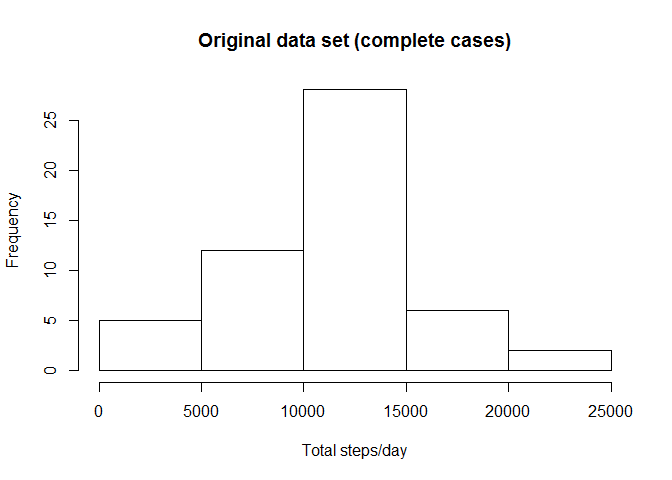
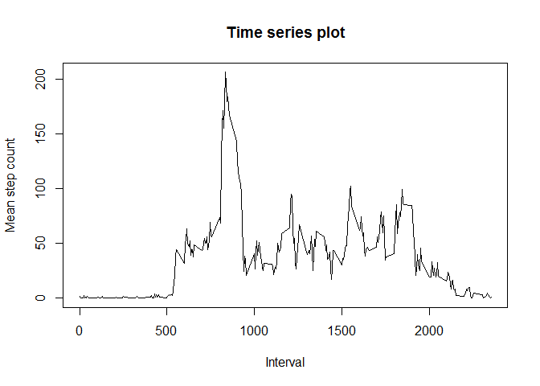
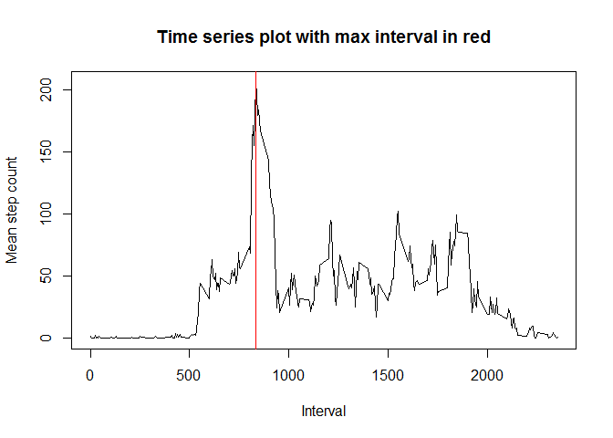
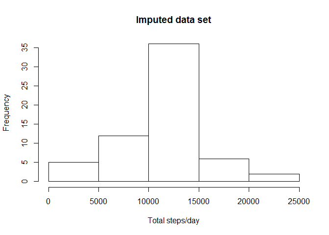
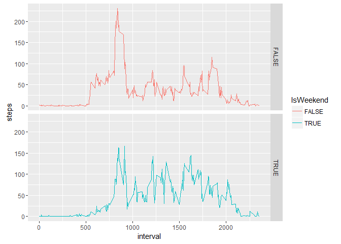

# Reproducible Research: Peer Assessment 1
Kasper Stovgaard  


## Loading and preprocessing the data
Loading the data (manually downloaded and unzipped) [1]


```r
setwd("C:/Users/KAST/Documents/DataScienceSpecialization/ReproducibleResearch")
activity_data <- read.csv("activity.csv")
```

And doing a quick check on input data format

```r
head(activity_data)
```

```
##   steps       date interval
## 1    NA 2012-10-01        0
## 2    NA 2012-10-01        5
## 3    NA 2012-10-01       10
## 4    NA 2012-10-01       15
## 5    NA 2012-10-01       20
## 6    NA 2012-10-01       25
```

```r
summary(activity_data)
```

```
##      steps                date          interval     
##  Min.   :  0.00   2012-10-01:  288   Min.   :   0.0  
##  1st Qu.:  0.00   2012-10-02:  288   1st Qu.: 588.8  
##  Median :  0.00   2012-10-03:  288   Median :1177.5  
##  Mean   : 37.38   2012-10-04:  288   Mean   :1177.5  
##  3rd Qu.: 12.00   2012-10-05:  288   3rd Qu.:1766.2  
##  Max.   :806.00   2012-10-06:  288   Max.   :2355.0  
##  NA's   :2304     (Other)   :15840
```

Then discarding entries with NA values before further processing, and checking the effect

```r
activity_data_complete <- activity_data[complete.cases(activity_data), ]
summary(activity_data_complete)
```

```
##      steps                date          interval     
##  Min.   :  0.00   2012-10-02:  288   Min.   :   0.0  
##  1st Qu.:  0.00   2012-10-03:  288   1st Qu.: 588.8  
##  Median :  0.00   2012-10-04:  288   Median :1177.5  
##  Mean   : 37.38   2012-10-05:  288   Mean   :1177.5  
##  3rd Qu.: 12.00   2012-10-06:  288   3rd Qu.:1766.2  
##  Max.   :806.00   2012-10-07:  288   Max.   :2355.0  
##                   (Other)   :13536
```


## What is mean total number of steps taken per day?

Following the question in the assignment, the histogram of the total number of steps taken each day is plotted [2]

```r
summed_steps_per_day <- aggregate(steps ~ date, activity_data_complete, sum)
hist(summed_steps_per_day$steps, xlab = "Total steps/day", main = "Original data set (complete cases)")
```



And the mean and median number of steps taken each day evaluated [3]

```r
mean(summed_steps_per_day$steps)
```

```
## [1] 10766.19
```

```r
median(summed_steps_per_day$steps)
```

```
## [1] 10765
```


## What is the average daily activity pattern?
The time series plot of the average number of steps taken is calculated and plotted [4]

```r
mean_steps_per_int <- aggregate(steps ~ interval, activity_data_complete, mean)
plot(mean_steps_per_int$interval, mean_steps_per_int$steps, type='l', xlab="Interval", 
    ylab="Mean step count", main = "Time series plot")
```



And the 5-minute interval that, on average, contains the maximum number of steps are evaluted [5] 
and added to the time series plot, as a sanity check

```r
mean_steps_per_int[which.max(mean_steps_per_int$steps),]
```

```
##     interval    steps
## 104      835 206.1698
```

```r
plot(mean_steps_per_int$interval, mean_steps_per_int$steps, type='l', xlab="Interval", 
    ylab="Mean step count", main = "Time series plot with max interval in red")
abline( v = mean_steps_per_int[which.max(mean_steps_per_int$steps),1],col = "red")
```




## Imputing missing values
Code to describe and show a strategy for imputing missing data is included here [6]

The number of entries with NA values is

```r
nrow(activity_data) - nrow(activity_data_complete)
```

```
## [1] 2304
```

If only a few data points contained NAs, I would have interpolated the missing values from 
the two neighbouring time points. Since this data set contains many, and several neighbouring
NAs, the suggested approach of assigning the interval mean for NAs is applied

```r
imputed_activity_data <- activity_data
for (counter in 1:nrow(activity_data)) 
{
    if(is.na(activity_data$steps[counter])) 
    {
        current_int <- activity_data$interval[counter]
        mean_step_given_interval <- mean_steps_per_int[mean_steps_per_int$interval == current_int,]$steps
        imputed_activity_data$steps[counter] <- round(mean_step_given_interval) # want integer steps
    }
}
```

The histogram of the total number of steps taken each day after missing values are imputed is plotted [7]

```r
imputed_summed_steps_per_day <- aggregate(steps ~ date, imputed_activity_data, sum)
hist(imputed_summed_steps_per_day$steps, xlab = "Total steps/day", main = "Imputed data set")
```



We notice that both the mean and median values close to the original data, as was the histogram

```r
mean(imputed_summed_steps_per_day$steps)
```

```
## [1] 10765.64
```

```r
median(imputed_summed_steps_per_day$steps)
```

```
## [1] 10762
```


## Are there differences in activity patterns between weekdays and weekends?
The activity intervals are split into weekdays and weeekends by adding new column

```r
imputed_activity_data$IsWeekend <- F
weekend_day_strings <- c("Saturday","Sunday")

for (counter in 1:nrow(imputed_activity_data)) 
{
    if(weekdays(as.Date(imputed_activity_data$date[counter])) %in% weekend_day_strings)
    {
        imputed_activity_data$IsWeekend[counter] <- T
    }
}
```

The mean steps across weekdays/weekends are evaluated and a panel plot comparing the average number of steps taken per 5-minute interval is constructed [8]

```r
split_step_means <- aggregate(steps ~ interval+IsWeekend, imputed_activity_data, mean)
library(ggplot2)
ggplot(split_step_means, aes(interval, steps)) + geom_line(stat = "identity", aes(colour = IsWeekend)) + facet_grid(IsWeekend ~ .) 
```



It is observed that the steps are distributed a bit more evenly throughout the day in the weekend compared to the 
weekdays, which cointain one distinct peak (likely going to work).

All of the R code needed to reproduce the results (numbers, plots, etc.) is included in this file [9].

